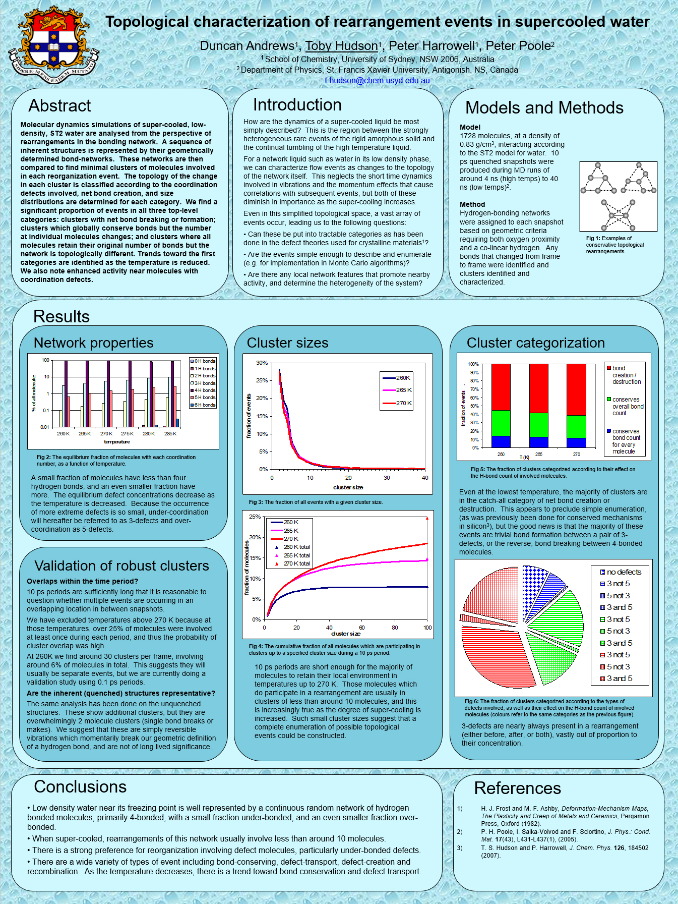

# ST2.Water
A C++ computer program, written for Associate Professor Toby Hudson and Professor Peter Harrowell, that analyses the output of molecular dynamics simulations of super-cooled, low density, ST2 water, produced by Professor Peter Poole at St Francis Xavier University, Canada.

